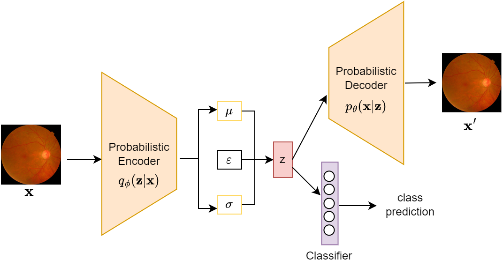

## Generalizing Across Domains in Diabetic Retinopathy via Variational Autoencoders
Accepted at MICCAI 2023 1st International Workshop on Foundation Models for General Medical AI (MedAGI)

## Overview
This repository contains the source code for the paper titled "Generalizing Across Domains in Diabetic Retinopathy via Variational Autoencoders,"

## Table of Contents
- [Introduction](#introduction)
- [Method](#method)
- [Getting Started](#getting-started)
- [Results](#results)
- [Citation](#citation)
- [References](#references)

## Introduction
Domain generalization for Diabetic Retinopathy (DR) classification allows a model to adeptly classify retinal images from previously unseen domains with various imaging conditions and patient demographics, thereby enhancing its applicability in a wide range of clinical environments. In this study, we explore the inherent capacity of variational autoencoders to disentangle the latent space of fundus images, with an aim to obtain a more robust and adaptable domain-invariant representation that effectively tackles the domain shift encountered in DR datasets. Despite the simplicity of our approach, we explore the efficacy of this classical method and demonstrate its ability to outperform contemporary state-of-the-art approaches for this task using publicly available datasets. Our findings challenge the prevailing assumption that highly sophisticated methods for DR classification are inherently superior for domain generalization. This highlights the importance of considering simple methods and adapting them to the challenging task of  generalizing medical images, rather than solely relying on advanced techniques. 

## Method



## Getting Started

### Datasets
We use publicly available datasets(Aptos, EyePACS, Messidor, Messidor-2), with DR grading levels from 0 (No DR) to 4 (Proliferative DR) which can be obtained from the following:
1. [Aptos 2019 Blindness Detection](https://www.kaggle.com/c/aptos2019-blindness-detection/data)
2. [Paper Link](https://www.ias-iss.org/ojs/IAS/article/view/1155)
   [DOI Link](https://doi.org/10.5566/ias.1155)
3. [Kaggle: Diabetic Retinopathy Detection - EYEPACS Dataset](https://www.kaggle.com/c/diabetic-retinopathy-detection)

### Dependencies
``` 
    pip install -r requirements.txt
```

### Environment used for our experiments
```
Environment
    Python: 3.7.7
    CUDA: 10.2
    CUDNN: 7605
    OS:  UBUNTU 20.04
```
### Methods for comparison
We compare our method to the ERM baseline as well as other Domain Generalization methods (DRGen and Fishr).
The implementations of the DG algorithms can be found:
1. [DRGen](https://github.com/BioMedIA-MBZUAI/DRGen)
2. [Fishr] - can be implemented by setting ```--swad False ``` in DRGen

### How to Run
The datasets directory must follow the [DomainBed](https://github.com/facebookresearch/DomainBed) dataset structure, i.e. organize the images into separate directories based on their respective labels. We averaged our results over 3 random seeds(0, 1, 2).
```
python train_all.py name_of_exp
                --dataset DR 
                --algorithm VAE_DG
                --data_dir path_to_datasets 
                --batch_size 22 
                --lr 1e-4 
                --optimizer Adam 
                --steps 15000
```

## Citation


## References
This repository contains some codes from the following:
1. [Miro](https://github.com/kakaobrain/miro/tree/main) - we use the MIRO version of [DomainBed](https://github.com/facebookresearch/DomainBed) which contains the SWAD implementation
2. [ResNetVAE](https://github.com/hsinyilin19/ResNetVAE/tree/master) - the Resnet VAE architecture

